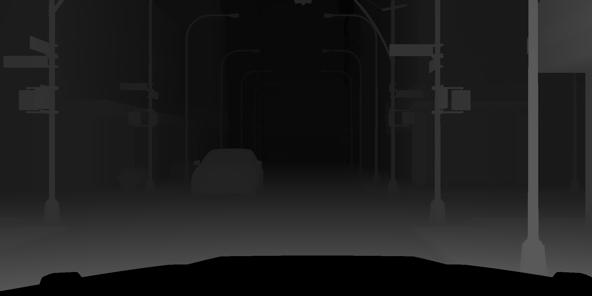
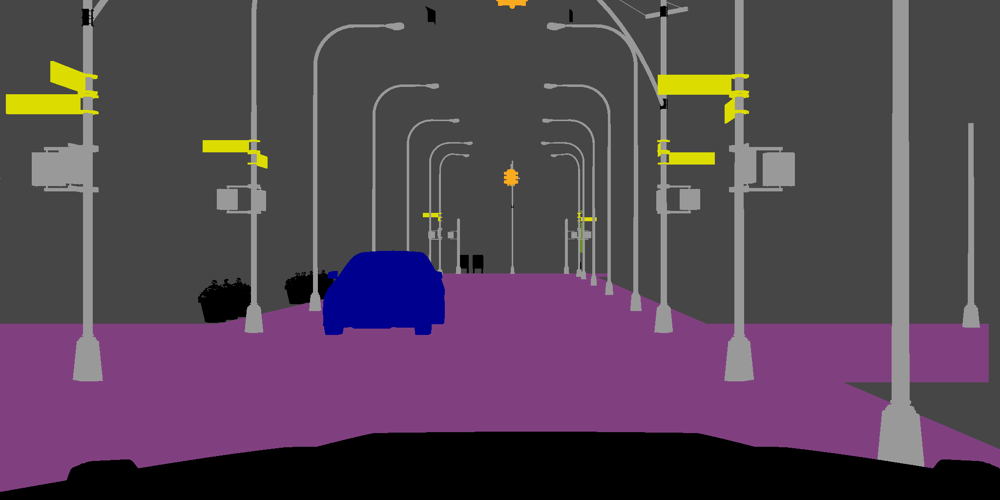
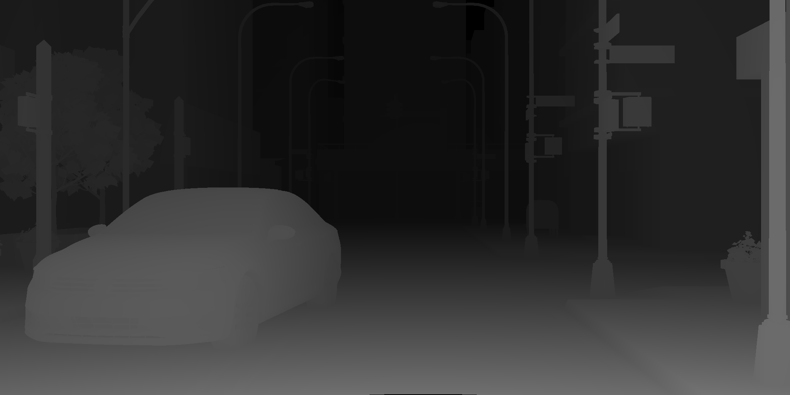
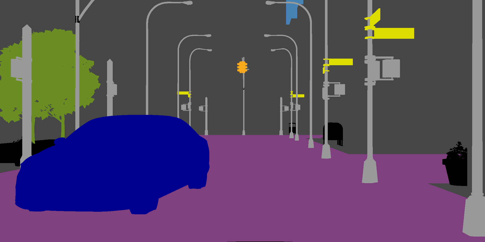

# Citynthesizer
##### A Blender-based data generation pipeline for urban driving. 
Citynthesizer is data generation pipeline that generates synthetic data for image recognition research in the context of urban driving. 
It is based on Blender [[1]](#1), its rendering-engine Cycles [[2]](#2), and the Blender Add-On SceneCity [[3]](#3). 
As of now, the pipeline supports ground truth for disparity maps and semantic segmentation and is heavily oriented along 
the CityScapes [[4]](#4) dataset. 

**Results**

| image  | disparity | semantic segmentation |
| ------------- | ------------- | ------------- |
|   |     |     |
|   |     |     |

## Table of Contents
[Citynthesizer](#citynthesizer)
  * [Requirements](#requirements)
  * [Installation](#installation)
  * [Initial Configuration](#initial-configuration)
  * [Usage](#usage)
  * [How does it work?](#how-does-it-work)
      - [Construction of the City](#construction-of-the-city)
      - [Embedding of Dynamic Objects](#embedding-of-dynamic-objects)
      - [Rendering of the Images](#rendering-of-the-images)
  * [Similarity of Data to CityScapes](#similarity-of-data-to-cityscapes)
  * [Modification Guidelines](#modification-guidelines)
      - [Adding Models of Cars](#adding-models-of-cars)
      - [Adding Models of Buildings](#adding-models-of-buildings)
  * [References](#references)

## Requirements
* Blender (v2.82a) with python (v3.7.4)
* Requirements for blender internal python version under [./others/blender_python_requirements.txt](others/blender_python_requirements.txt)
* SceneCity (v1.7.0) (Blender Add-On)
* HDRI sky map
* Models of vehicles to be incorporated
## Installation

* Setup blender and its internal python according to [./others/blender_python_requirements.txt](others/blender_python_requirements.txt) with 
```shell
path/to/blender_python$ pip install -r blender_python_requirements.txt
``` 
* Install OpenEXR (see https://excamera.com/sphinx/articles-openexr.html) and add python bindings to blender's python
* Either manually install SceneCity in blender, or optionally move it under the name 'SceneCity.zip' 
  to [./others](others) and uncomment the installation lines in [./setup.py](setup.py).
## Initial Configuration
Citynthesizer does not ship with sky HDRIs nor with models of vehicles due to licensing. 
Both are needed for a fully functional pipeline.
Models of cars can for instance be acquired via [Chocofur](https://store.chocofur.com/search/cars).

##### HDRIs
Provide an HDRI depicting a sky or the like and save it under ./HDRI/example.hdr.
Specify the name of the desired HDRI under sky_HDRI in [./setup.py](setup.py).

##### Car Models
To fully function at least one carmodel has to be provided, to do this see [Adding Models of Cars](#Adding-Models-of-Cars).
## Usage 
Define the parameters of the desired city in [./setup.py](setup.py). Run [./setup.py](setup.py) on [./standard.blend](standard.blend) with
```shell
path/to/blender$ ./blender path/to/Citynthesizer/standard.blend -b -P path/to/Citynthesizer/setup.py 
```

The generated ground_truth is stored under ./ground_truth/current_run and additionally copied to
/ground_truth/CityScapes_format. 

Alternatively, [./multiple_runs.sh](multiple_runs.sh) can be used to execute multiple such runs. 
In this case data is only accumulated in the CityScapes [[4]](#4) format.
## How does it work?
Citynthesizer generates data via runs. Each run constructs one variant of the simulation and extracts the relevant data,
which is subsequently accumulated as dataset only in the CityScapes [[4]](#4) format. Being a pipeline by design, the
runs are of procedural nature and can be divided in four successive steps, namely the placement of static objects, 
the embedding and animation of dynamic objects, the rendering of relevant scenarios, and post-processing.
#### Construction of the City
The City is constructed by making use of the Blender Python API [[5]](#5) and automating the steps implemented in 
SceneCity [[3]](#3) to create a 'GridCity'. Furthermore a HDRI sky map is incorporated acting as the only light source 
for the scene. By default only the assets coming with SceneCity [[3]](#3) are used to generate the city -  all with 
equal probabilities. The detailed generation process is described in SceneCity's [[3]](#3) documentation, 
[here](https://scenecitydoc.cgchan.com/grid-cities). Additionally provided, handmade, static assets would be
incorporated in the SceneCity [[3]](#3) generation process. 
#### Embedding of Dynamic Objects
Dynamic objects are implemented by planning out the simulation in its entirety before implementing it as an animation
via the Blender Python API [[5]](#5). The reasoning behind this design is to gain optimal entry points for filtering stages,
saving computational costs. The city's groundplan is based on a grid comprised of different cells. To generate paths 
for dynamic objects, each cell corresponding to a road object is portrayed as a node of an undirected graph, where an edge
between two nodes exist, if the respective cells are adjacent. Each node located at the edge of the map serves as a 
starting-/end-point. Paths are generated via random walk under the constraint that the most recently chosen edge is 
not available for the next step.
The desired number of paths to be generated in this way is defined in [./setup.py](setup.py) and limited by the number 
of available starting-points. 

If more than two paths are constructed, collision avoidance procedures based on the paths are implemented via a 
priority queue, where the less prioritized car's path is truncated in the case of a collision. 

At this stage the setup of the animation is filtered for the first time via criteria concerning the simulation in its 
entirety, e.g. number of cars, ego vehicle's path length, etc. This aims to to estimate the suitability of the 
simulation in the light of the engineer's specific needs, trying to avoid the computationally expensive setup of an 
unsuitable simulation. If the simulation passes, the models are linked and animated in the scene.
#### Rendering of the Images
The ego-vehicle carries the camera and is simultaneously the car with the highest priority. Ground truth along the path
of the ego-vehicle is then rendered via Blender's [[1]](#1) render layers making use, amongst others, of the library 
bpycv [[6]](#6). Another filtering stage is entered that aims to filter suitable frames based on the information 
provided by the ground truth, e.g. minimum number of cars per frame, maximal distance between traffic participants. 
Only then the actual rendering stage is initiated and the corresponding images are rendered. 
Next to the savings in computational costs, this helps to generate datasets tailored to a specific definition 
for critical scenarios.

## Similarity of Data to CityScapes

Every run is saved in a format similar to CityScapes [[4]](#4).
The city is called 'scenecity' and every run corresponds to one sequence. 
To which split ('train', 'test', 'val') a data set belongs is determined by random choice weighted with percentages 
(Default for 'test' and 'val': 0.0). 

The camera setting ([./data/camera.json](data/camera.json)) is taken from CityScapes [[4]](#4) 
(originally: aachen_000000_000019_camera.json) and used to calculate disparity- from depth-maps. 
It is additionally copied to comply with the CityScapes [[4]](#4) format.
Because stereo-imaging is not available only the intrinsic parameters are implemented in blender.

**Labeling Conflicts**

At the moment mainly two labeling conflicts arise with respect to the CityScapes dataset [[4]](#4), 
if used out-of-the-box with SceneCity [[3]](#3).
* Sidewalks are labeled as roads
* Front- and backside of traffic signs are both labeled as such     

## Modification Guidelines

#### Adding Models of Cars
1. Provide model in .blend file with one parent object (from now on referred to as main_object), for all meshes. For convenience save it under [./models/cars](models/cars).
1. The name of all meshes should contain the corresponding CityScapes-label. (At the moment only 'car', 'truck' supported.)
1. In [./setup.py](setup.py) under car_models_info provide the information needed for Citynthesizer to process the model:
    * file path
    * scaling factor 
    * name of the main_object
    * position of the camera relative to the car

#### Adding Models of Buildings
Buildings are incorporated via SceneCity and need to be linked manually to the scene. 
Efforts to incorporated easy asset ingestion are to be undertaken. 
Best practice to add custom models is, as of now, to save them under [./models/buildings](models/buildings), 
link them under link_assets(), and add their main parent object in buildings_bl_objects 
both to be found in [./scripts/city_handler.py](scripts/city_handler.py).

## References
<a id="1">[1]</a> 
Blender website. 
URL https://www.blender.org/ 


<a id="2">[2]</a> 
Cycles website. 
URL https://www.cycles-renderer.org/ 

<a id="3">[3]</a> 
SceneCity website. 
URL https://www.cgchan.com/

<a id="4">[4]</a> 
Cordts, Marius, et al. 
"The cityscapes dataset for semantic urban scene understanding." 
Proceedings of the IEEE conference on computer vision and pattern recognition. 2016.

<a id="5">[5]</a> 
Blender Python API (v2.82a) website.
URL https://docs.blender.org/api/2.82a/

<a id="6">[6]</a> 
bpycv - computer vision and deep learning utils for blender. 
URL https://github.com/DIYer22/bpycv
